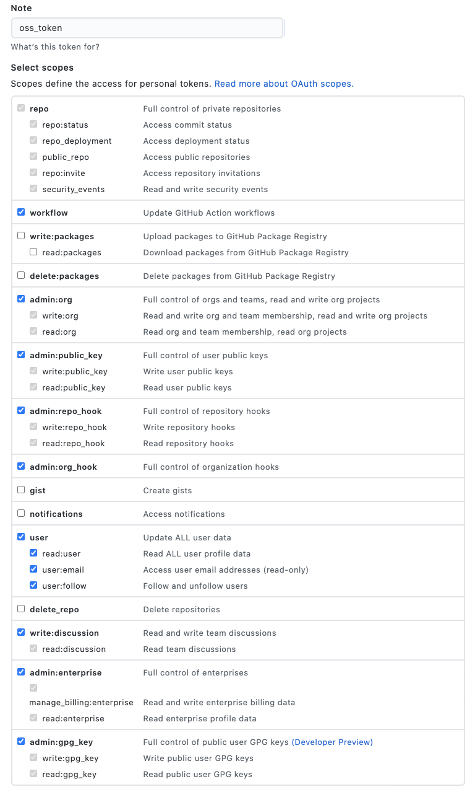

# dspg21oss
## Collect Access Token 

*This won't take longer than 5 min.* 

We are collecting access token to speed up the process of scraping GitHub repositories. One access token can only scrape 5000 repositories in an hour, and our goal is to scrape about 10 million repositories. Having more acess token would help us tremendously. 

Please refer to [this document](https://docs.github.com/en/github/authenticating-to-github/keeping-your-account-and-data-secure/creating-a-personal-access-token) for detailed instruction in creating a personal access token. 

You will need to select the scopes for this personal token, please refer to the following image.

Please private message Crystal or Stephanie your 
- access token 
- username  

and make sure you delete the message (not the access token) afterwards. 

*We appreciate your help!* 
